# Task 1: Deploy your ASP.Net Core application to your local IIS server.

I created a new solution

```bash
$ dotnet new sln -n WebApplication1
```

I created an ASP.NET Core MVC project instead of Web API

```bash
$ dotnet new mvc -o WebApplication1.Web
```

I added the MVC project to the solution
```bash
$ dotnet sln add WebApplication1.Web
```

I ran the project for checking everything looks fine

```bash
$ dotnet run --project WebApplication1.Web
```


I configured IIS and granted permission to access the directory where my app is deployed, creating the application pool following the Self Study Material:

https://www.linkedin.com/learning/deploying-asp-dot-net-core-applications-from-fundamentals-to-advanced-deployment-strategies/creating-and-configuring-a-website-in-iis-24458853?autoSkip=true&resume=false&u=106534538

I got the project running on IIS, as shown in the screenshots below:

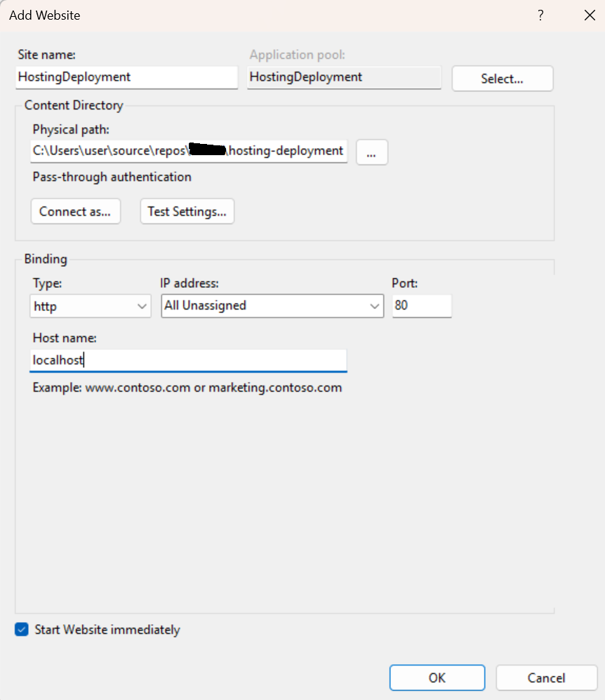

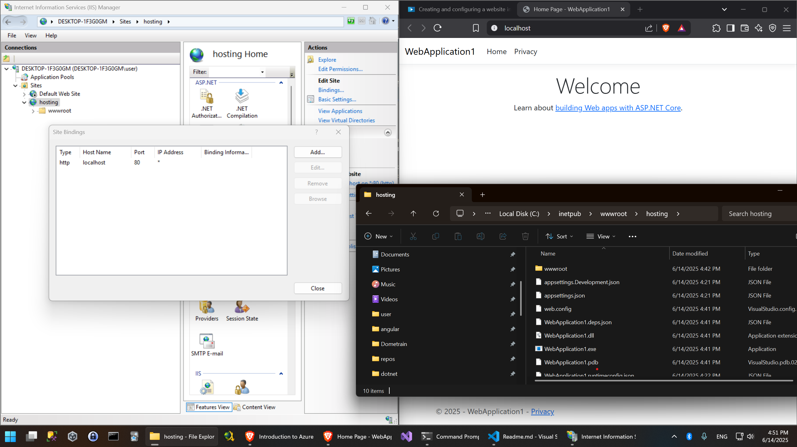

# Task 2: Deploy your ASP.Net Core application to Azure App Service 

## 2.1 Via Visual Studio

I used the same template application from Task 1. First, I created the required Azure App Service:

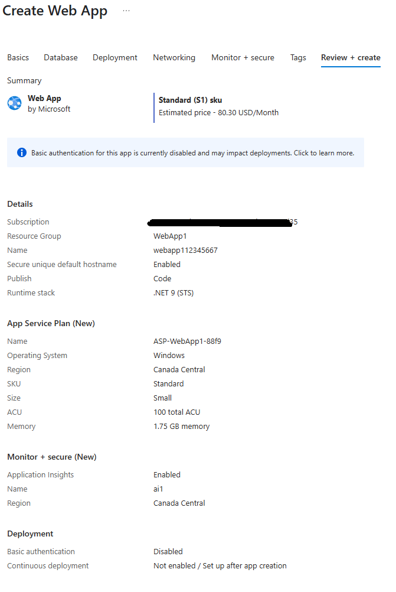

Then, using Visual Studio 2022, I published the app by selecting the previously created Web App:

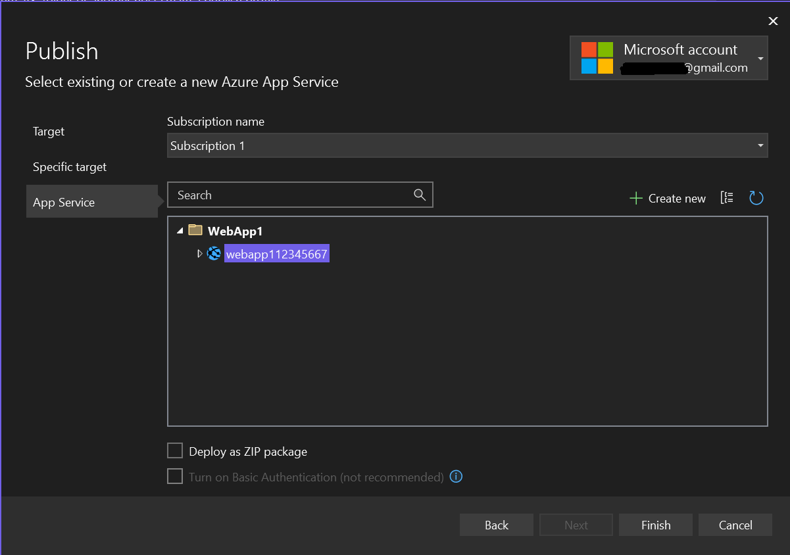

I pressed Publish, and Visual Studio handled the deployment

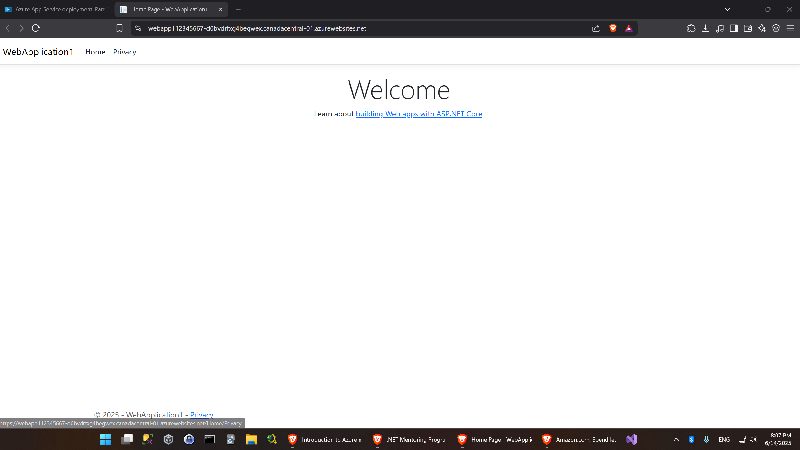

## 2.2 Via Azure CLI

First, I registered the Microsoft.Web namespace:

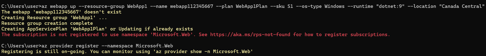

From the root of my solution, I ran the following commands:

I created a new resource group called WebApp1 in the Canada Central region

```bash
$ az group create --name WebApp1 --location "Canada Central"
```

I set up an S1-tier App Service Plan named WebApp1Plan under the WebApp1 group

```bash
$ az appservice plan create --name WebApp1Plan --resource-group WebApp1 --location "Canada Central" --sku S1
```

I provisioned a .NET 9 Web App named webapp112345667 on the WebApp1Plan

```bash
$ az webapp create --name webapp112345667 --plan WebApp1Plan --resource-group WebApp1 --runtime "dotnet:9"
```

I built the MVC app in Release mode for .NET 9 and writes the output into the publish folder
```bash
$ dotnet publish -c Release -f net9.0 -o ./publish
```

### I compressed the contents of the publish folder into publish.zip. I made the common mistake of compressing the folder itself instead of its contents

I pushed the ZIP package to Azure and deployed it to the web app

```bash
$ az webapp deploy --resource-group WebApp1 --name webapp112345667 --type zip --src-path publish.zip
```

Finally, I browsed to my newly deployed web app:

```bash
$ az webapp browse --resource-group WebApp1 --name webapp112345667
```

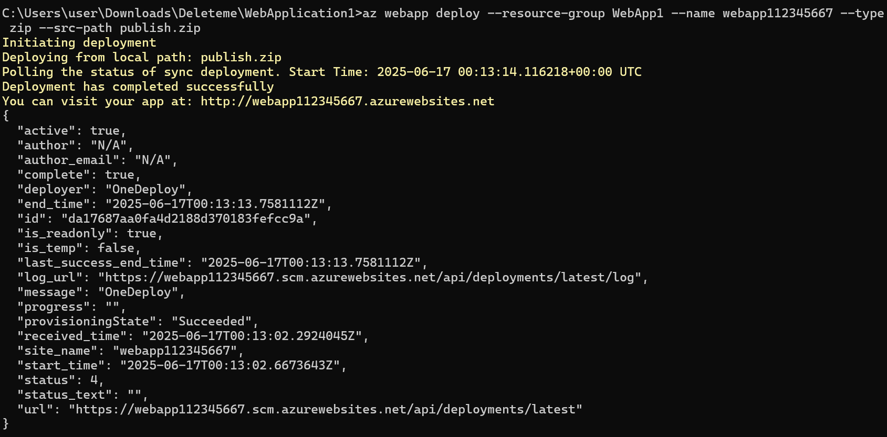

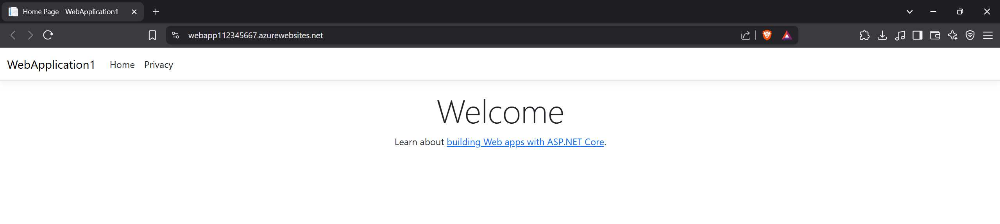

## 3 Via Azure CLI

We will be using the following Dockerfile

```Dockerfile
FROM mcr.microsoft.com/dotnet/sdk:9.0 AS build
WORKDIR /src

COPY ["WebApplication1.csproj", "./"]
RUN dotnet restore "./WebApplication1.csproj"

COPY . .
RUN dotnet publish -c Release -o /app/publish

FROM mcr.microsoft.com/dotnet/aspnet:9.0
WORKDIR /app

ENV ASPNETCORE_URLS=http://+:80
EXPOSE 80

COPY --from=build /app/publish .
ENTRYPOINT ["dotnet", "WebApplication1.dll"]
```

Now we create the needed resources

### Provision ACR

```bash
$ az group create --name MyWebApp1 --location "Canada Central"
$ az acr create --resource-group MyWebApp1 --name mywebapp1acr --sku Basic
$ az acr update --name mywebapp1acr --admin-enabled true
$ az acr login --name mywebapp1acr
```

### Build, tag & push your Docker image to ACR

```bash
$ docker build -t webappdocker:latest .  
$ docker tag webappdocker:latest mywebapp1acr.azurecr.io/webappdocker:latest
$ docker push mywebapp1acr.azurecr.io/webappdocker:latest
```

### Create App Service Plan and Web App (container)
We use S1 to enable SSD usage, otherwise, this process will be very slow.

```bash
$ >az appservice plan create --resource-group MyWebApp1 --name MyWebApp1Plan --is-linux --sku S1
$ az webapp create --resource-group MyWebApp1 --plan MyWebApp1Plan --name webappcontainerdemo001 --container-image-name mywebapp1acr.azurecr.io/webappdocker:latest

$ az acr credential show --name mywebapp1acr --query username -o tsv
>>> mywebapp1acr

$ az acr credential show --name mywebapp1acr --query "passwords[0].value" -o tsv
>>> xEZO7g1Obcwj3lGsN/Lsy3z76j58i+GJBkHlEfp+1f+ACRCJPNQ+

$ az webapp config container set --name webappcontainerdemo001 --resource-group MyWebApp1 --container-registry-url https://mywebapp1acr.azurecr.io --container-registry-user mywebapp1acr --container-registry-password xEZO7g1Obcwj3lGsN/Lsy3z76j58i+GJBkHlEfp+1f+ACRCJPNQ+
$ az webapp browse --resource-group MyWebApp1 --name webappcontainerdemo001
```

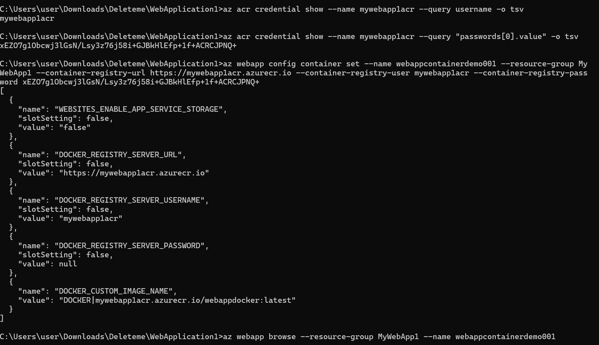
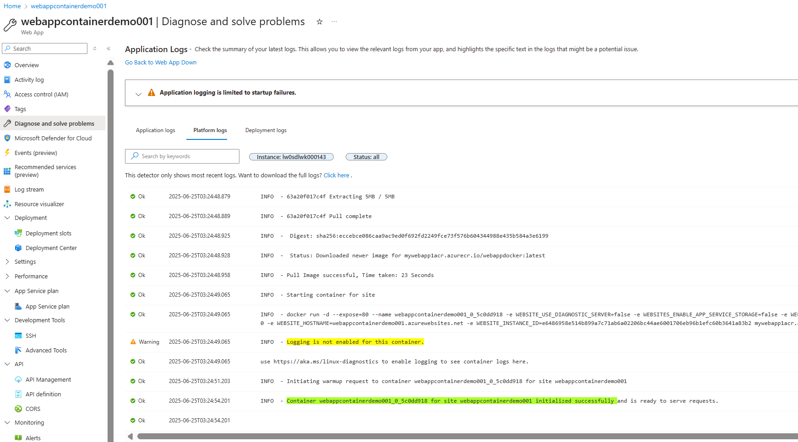
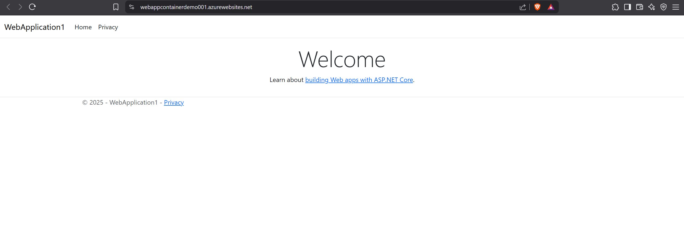